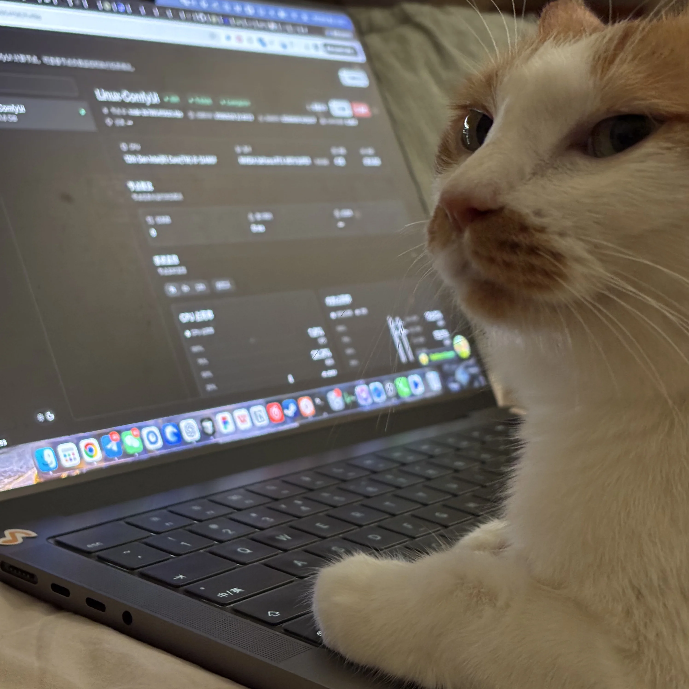
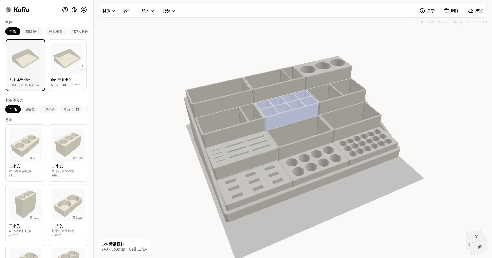
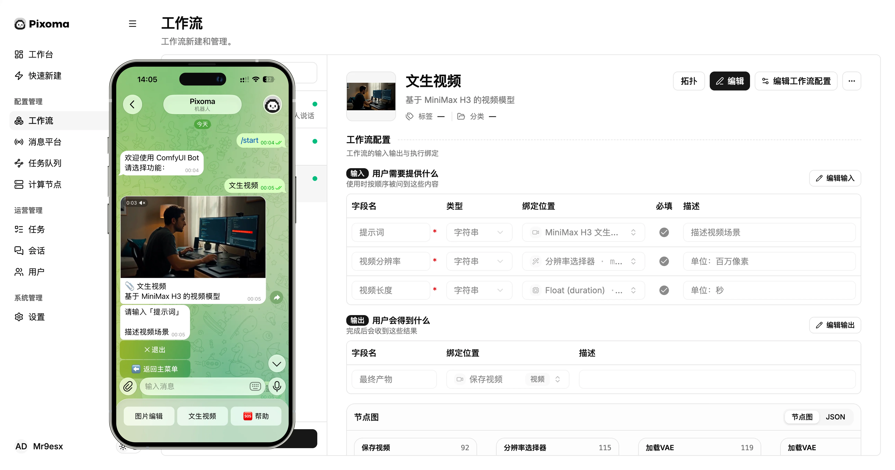
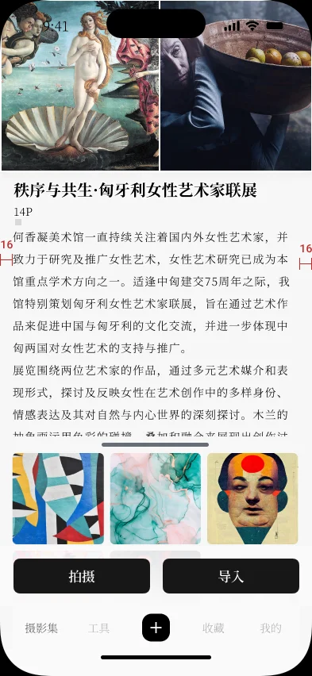
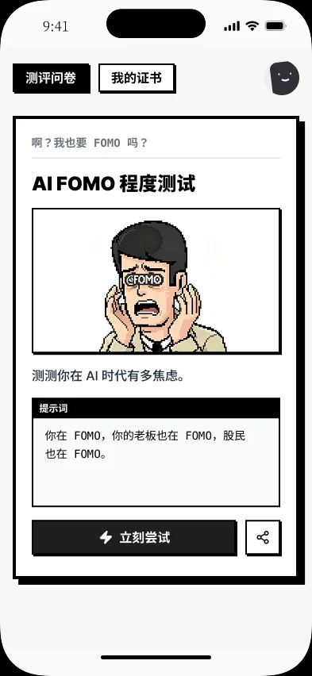
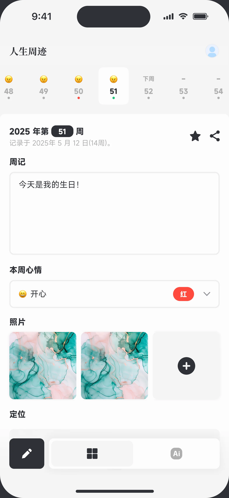
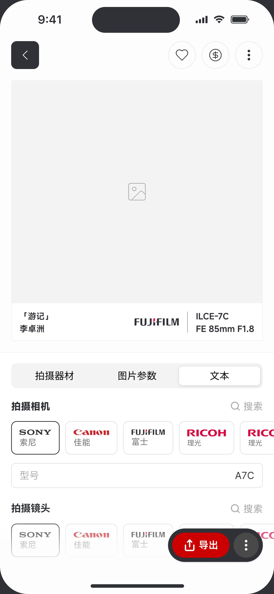
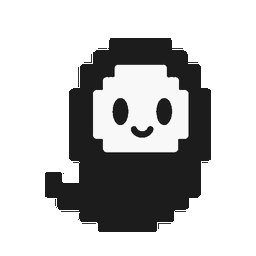

  
   
  <em>Shot in Shanghai, October 4, 2024.</em>

<h3 align="center">
  <i>
    <samp>&gt; I’m a tinkerer, and my wish is to spend my life doing what I love.</samp>
  </i>
</h3>

  <em>Born in Zhaoqing, China. Now based in Guangzhou. 
  A kind father, with a kind mother by my side, and four rascals to show for it.</em>

  
  
  

---

## Here are some projects I’m working on:

### Public

<table>
<tr>
<td valign="top" width="50%">

KuRa - 「倉」

</td>
<td valign="top" width="50%">

Pixoma - /pɪkˈsoʊmə/

</td>
</tr>
<tr>
<td valign="top" width="50%">

***一套 3D 打印组合式收纳系统，支持模块化组合与可视化布局，轻松规划收纳空间。***

Website: <a href="https://kura.miaoplus.com/" target="_blank" rel="noopener noreferrer">https://kura.miaoplus.com</a>

> ***Is a modular 3D‑printed storage system. It supports modular assembly and visual layout, letting you easily plan your storage space.***

</td>
<td valign="top" width="50%">

***把 ComfyUI 变成可移动 AI 工具，让你随时随地把灵感变成作品。***

Product Page: <a href="https://pixoma.miaoplus.com/" target="_blank" rel="noopener noreferrer">https://pixoma.miaoplus.com</a>

> ***Turn ComfyUI into a portable AI tool, turning your inspiration into creations anywhere, anytime.***

</td>
</tr>
<tr>
<td valign="top" width="50%">

</td>
<td valign="top" width="50%">

</td>
</tr>
</table>

### Untitled / In Progress

<table>
<tr>
<td valign="top" width="25%">
未命名一
</td>
<td valign="top" width="25%">
未命名二
</td>
<td valign="top" width="25%">
未命名三
</td>
<td valign="top" width="25%">
未命名四
</td>
</tr>
<tr>
<td valign="top" width="25%" align="center">

</td>
<td valign="top" width="25%" align="center">

</td>
<td valign="top" width="25%" align="center">

</td>
<td valign="top" width="25%" align="center">

</td>
</tr>
</table>  

## Here are some things I tinker with:

<table>
<tr>
  <td>OS</td>
  <td>
    
    
    
    
    
  </td>
</tr>
<tr>
  <td>Backend & Framework</td>
  <td>
    
    
    
    
    
    
  </td>
</tr>
<tr>
  <td>Frontend & Framework</td>
  <td>
    
    
    
    
    
    
    
    
    
    
  </td>
</tr>
<tr>
  <td>Client & Framework</td>
  <td>
    
    
    
    
  </td>
</tr>
<tr>
  <td>AIGC</td>
  <td>
    
    
    
    
    
    
    
    
    
    
    
  </td>
</tr>
<tr>
  <td>Containerization</td>
  <td>
    
    
  </td>
</tr>
<tr>
  <td>CI / CD</td>
  <td>
    
    
    
  </td>
</tr>
<tr>
  <td>Database & Middleware</td>
  <td>
    
    
    
    
    
    
    
    
    
  </td>
</tr>
<tr>
  <td>Vibe Code</td>
  <td>
    
    
  </td>
</tr>
<tr>
  <td>Toolchains</td>
  <td>
    
    
    
  </td>
</tr>
<tr>
  <td>Design</td>
  <td>
    
    
    
  </td>
</tr>
<tr>
  <td>3D Print</td>
  <td>
    
    
  </td>
</tr>
<tr>
  <td>Monitoring</td>
  <td>
    
    
    
  </td>
</tr>
<tr>
  <td>Game</td>
  <td>
    
    
    
  </td>
</tr>
</table>

  
   
  

